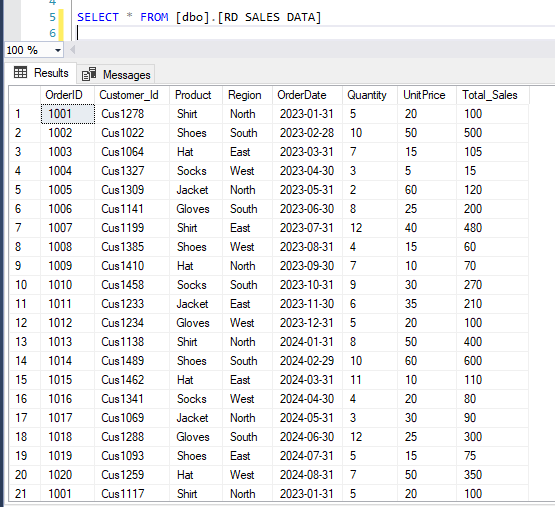

# LITA_SALES-DATA

### PROJECT TITLE: Sales Performance Analysis for A Retail Store

### PROJECT OVERVIEW

This project aims to analyze sales data for retail store to identify trends, patterns, and areas for improvement. The analysis will provide insights into sales performance, customer behavior, and product preferences, enabling data-driven decisions to drive business growth.

### DATA SOURCE

The primary source of data used is Data Sale.csv and this is an open source data that can be freely downloaded from an open source online such ad Kaggle or any other data repository site.

## TOOLS USED
- Microsoft Excel [Download here](https://www.microsoft.com)
1. For Data Cleaning.
2. For Data Analysis.
3. Data Visualization.
   
- SQL (Structured Query Language) for query of Data
  
- PowerBi
1. For Data VIsualization.
2. Data Modelling.
3. Data Analysis.
4. Data Reporting.
5. Business Intelligence.

- GitHub for Potfolio Building

## DATA CLEANING AND PREPARATION
In the inital phase of the Data Cleaning and Preparation, we perform the following action.

1. Data loading and inspection.
2. Handling missing values.
3. Removing duplicates.
4. Data Transformation.
5. Data Quality checks.
6. Data Cleaning and formatting.

## EXPLORATORY DATA ANALYSIS
EDA involved the exploring of the data to answer some questions about the Data such as

1. Retrieve the total sales for each category.
2. Find the number of sales transactions in each region.
3. FInd the highest selling product by total sales value.
4. Calculate total revenue per product.
5. Calculate monthly sales totals for the current year.
6. Find the top 5 customers by total purchase amount.
7. To calculate the percentage of total sales contributed by each region.
8. Identify products with no sales in the last quarter.

## DATA ANALYSIS
```SQL
1. SELECT * FROM [dbo].[RD SALES DATA]

2. ---- NO 1. To retrieve the total sales for each category

SELECT product, sum([Total_Sales]) AS Total_Sales
FROM [dbo].[RD SALES DATA]
GROUP BY product
ORDER BY SUM([Total_Sales]) DESC;

3. -----  No 2. find the number of sales transactions in each region

SELECT Region , COUNT([Quantity]) AS Count_Sales
FROM  [dbo].[RD SALES DATA]
GROUP BY Region
ORDER BY COUNT([Quantity])

4. ----  NO 3. fInd the highest selling product by total sales value

SELECT TOP 1 PRODUCT, SUM(quantity*[UnitPrice]) AS Total_Revenue
FROM [dbo].[RD SALES DATA]
GROUP BY product

5. ---- NO 4. Calculate total revenue per product
 
 SELECT Product, SUM([Total_Sales]) AS Revenue
 FROM  [dbo].[RD SALES DATA]
 GROUP BY  product
 ORDER BY Sum([Total_Sales]) ASC;

6.  ---NO 5. calculate monthly sales totals for the current year.

     Select month(OrderDate) as month,
  sum(quantity*unitprice) as MonthlySales
From [dbo].[RD SALES DATA]
Where year(OrderDate) = year(GetDate())
Group by month(OrderDate)
Order by Month;

7. --- NO 6. Find the top 5 customers by total purchase amount.

SELECT TOP 5 [Customer_Id], SUM([Total_Sales]) AS total_purchase_amount
FROM [dbo].[RD SALES DATA]
GROUP BY [Customer_Id]
ORDER BY SUM([Total_Sales]) DESC;

8. SELECT 
    Region, 
    SUM(Quantity * UnitPrice) AS Regional_Sales,
    (SUM(Quantity * UnitPrice) * 1.0 / (SELECT SUM(Quantity * UnitPrice) 
	FROM [dbo].[RD SALES DATA])) * 100 AS Percentage_of_Total_Sales
FROM 
    [dbo].[RD SALES DATA]
GROUP BY 
    Region
ORDER BY 
    Regional_Sales DESC;

9. SELECT Product FROM [dbo].[RD SALES DATA]
GROUP BY Product
HAVING SUM(CASE 
WHEN OrderDate BETWEEN '2024-06-01' AND '2024-08-31' 
THEN 1 ELSE 0 END) = 0
```
## DATA VISUALIZATION



